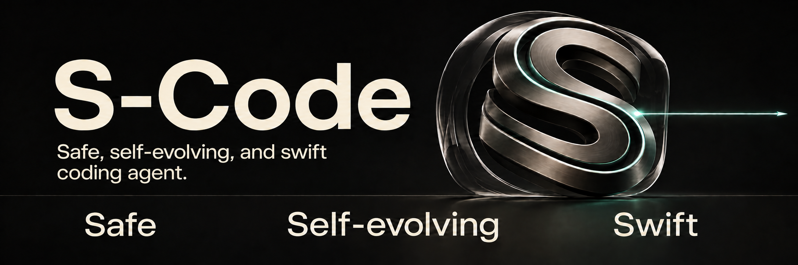

<div align="center">

# S-Code



A local-first coding agent for your terminal and browser.<br>
**Sandboxed commands. Reusable context. Less repeated work.**

<p>
  <a href="LICENSE"></a>
  <a href="docs/deployment/community.md"></a>
  <a href="docs/deployment/preview-release.md"></a>
</p>

[**Get started**](#get-started) · [Documentation](https://s-code-docs.shilong86.chatgpt.site) · [Security](#privacy-and-control) · [Benchmarks](#efficiency-and-evidence)

</div>

> **Developer Preview** · `v0.1.0-preview.1` · source only.
> Private staging; no supported public release yet. Candidates are identified
> by their exact Community commit and workflow run.

## Get started

Use macOS or Linux. The source installer checks your environment and offers to
install missing build tools and dependencies. You do not need to prepare Rust
or Node.js yourself. [Installation details →](docs/deployment/community.md#prerequisites)

**1. Install from source**

```sh
git clone https://github.com/sl-7qx/s-code.git
cd s-code
scripts/install-from-source.sh
```

Installs into `$HOME/.local/bin`; make sure it is on `PATH`.
Git is needed for the clone above; alternatively, download and extract the
repository's source ZIP, then run the same installer inside it.

**2. Connect your model**

```sh
s-code setup
s-code doctor
```

Choose OpenRouter, OpenAI, Anthropic, Gemini, a local model or a custom
OpenAI-compatible endpoint. Setup stores the credential's environment-variable
handle, never the provider secret.

**3. Choose your interface**

```sh
s-code       # Terminal
s-code web   # Browser
```

Both interfaces use the same local sessions, tools, approvals and events.
The CLI starts the loopback service automatically.

<details>
<summary><strong>Setup checks and credentials</strong></summary>

`setup` supports OpenRouter, OpenAI, Anthropic, Gemini, local and custom
OpenAI-compatible endpoints. It stores only the environment-variable handle,
never the provider secret. `doctor` verifies the local service, encrypted
storage, credential-handle availability and bounded model-catalog reachability
before the first task. Because some providers expose a public model catalog,
only the first real task can prove that a provider accepted the credential.

</details>

<details>
<summary><strong>Installation options, updates and moving from Opencoding Community</strong></summary>

Set `S_CODE_INSTALL_DIR` to choose a different installation directory.
`s-code` is the public command; packaged CLI and daemon helpers are internal
implementation details.

The installer reuses compatible tools. Missing Rust 1.89 and Node.js 22/npm
are prepared automatically after confirmation; newly bootstrapped tools live
under `~/.cache/s-code/build-tools`. Your shell profiles and existing Node
installation are unchanged. Python 3.9+, Git and build tools are installed
through supported system package managers; Linux also needs Bubblewrap for
command isolation. System packages may require your administrator password.
On macOS, complete Apple's developer-tools dialog if prompted; a missing
Python can be installed through an existing Homebrew installation.

Use `scripts/install-from-source.sh --check-deps` to inspect prerequisites,
`--yes` to approve dependency installation without the initial prompt, or
`--no-install-deps` to build using only existing tools. These build tools are
not required merely to launch the installed S-Code; tools needed by your own
projects are configured separately.

Community currently publishes no precompiled archive, binary installer or
automatic updater. To update, stop S-Code, pull a reviewed revision or
version tag, run `scripts/install-from-source.sh`, then start `s-code`
again. The installer never kills active work; if you installed while the old
service was still active, run `s-code restart`.

**Moving from Opencoding Community:** S-Code starts a fresh installation and
profile, including when the old candidate used `v0.1.0-preview.1`. Stop the old
daemon using its original launcher, preserve `~/.opencoding` and the old binary
if you need its history, then run `s-code setup` to create `~/.s-code`.
Do not reuse old databases, backups or configuration with S-Code: encryption
identifiers, database migrations and client namespaces changed. The rename
leaves your old state untouched; no in-place migration is provided.

</details>

## Why S-Code

| Principle | What the Preview delivers |
| --- | --- |
| **Safe** | Built-in commands run in an OS sandbox with scoped writes and network access off by default. [See the boundaries →](#privacy-and-control) |
| **Self-evolving · foundations** | Task feedback, memory you explicitly save for later sessions, and repeatable evaluations. [See what exists today →](#feedback-and-memory) |
| **Swift** | Precise file operations and bounded history reduce repeated work. Terminal and browser share the same running agent service. [See the mechanisms →](#efficiency-and-evidence) |

### Feedback and memory

The Preview provides foundations for self-evolution. **Autonomous learning and
self-upgrades are not implemented.** You control which context is saved and
reused.

<details>
<summary><strong>What the self-evolving foundations do today</strong></summary>

- **Task feedback:** tool results return to the model; bounded retries let it
  respond to failures within the current task.
- **Saved memory:** explicitly save cited context for a project, your sessions
  or a team. Relevant saved context is loaded into later sessions, with expiry
  and scope controls.
- **Repeatable evaluations:** frozen tasks and outcome checks let contributors
  measure the effects of a change. They do not automatically modify the agent.

The implementation is available in the [agent loop](crates/agent-core/src/lib.rs),
[memory interface](web/src/main.ts), [context assembly](crates/daemon/src/lib.rs)
and [evaluation runner](crates/evals/src/main.rs).

</details>

## Privacy and control

Built-in tool commands start without network access. Model requests go to the endpoint
you configure, which may be external. Provider keys stay out of browser
JavaScript, browser storage and URLs.

[Read the security architecture →](docs/architecture/security.md)

<details>
<summary><strong>The six enforced controls</strong></summary>

- **Command sandbox:** macOS Seatbelt and Linux sandbox profiles enforce the
  selected read-only or workspace-write boundary.
- **Network off:** tool commands start without network access; enabling it is a
  separately governed capability.
- **Secret protection:** well-known sensitive workspace paths, parent traversal
  and high-confidence credential-shaped process output are blocked or redacted.
- **Browser isolation:** Provider keys and the daemon bearer token never enter
  browser JavaScript, Web Storage, or URLs. Only authenticated local clients
  (the installed launcher or experimental IDE client) may mint a single-use
  browser bootstrap. It hands
  that value through a URL fragment, which the page erases immediately before
  exchanging it for an HttpOnly, SameSite=Strict cookie.
- **Private local state:** fresh installs keep state under
  `~/.s-code/state`, use private filesystem permissions and encrypt
  sensitive transcript, attachment, extension and audit payloads with a locally
  generated managed key. Operational indexes remain plaintext.
- **Protected audit:** local audit payloads and transcript content are encrypted;
  content-free metadata can be exported separately for verification.

</details>

<details>
<summary><strong>Where the safety boundary stops</strong></summary>

Configured external model providers receive the context sent to them. Approved
local MCP servers, hooks and background terminals execute as trusted host code
with the authority of your OS account. Local encryption protects stored
sensitive payloads; it does not protect against an attacker who controls that
account. Read the [security architecture](docs/architecture/security.md) for the
full execution and data boundaries.

</details>

## One local execution plane

`CLI + Local Web` → `Local execution service` → `Your model endpoint`

The local service owns sessions, tools, policy, approvals, audit and persistence.
The browser uses those same sessions and events.

<details>
<summary><strong>Process and credential boundaries</strong></summary>

The execution service owns sessions, Agent execution, tools, approvals, audit
and local persistence. In direct-provider mode the daemon resolves the named
environment handle and sends the request, so the daemon process can access that
credential value. With an independent local model proxy, only the proxy holds
the provider key and the daemon needs no provider secret. Both modes keep the
browser thin and outside the provider-credential boundary.

Read the [architecture overview](docs/architecture/overview.md) for the process
and trust boundaries.

</details>

## Efficiency and evidence

S-Code includes frozen algorithm, repository and frontend tasks with repeatable
outcome checks. The Preview does not publish a universal speed or token ranking.

[Read the benchmark method →](docs/testing/README.md#coding-harness-benchmarks)

<details>
<summary><strong>How the agent reduces repeated work</strong></summary>

- **Precise file operations** reduce malformed patches, stale writes and
  recovery turns.
- **Bounded history** compacts older payloads without discarding recent
  evidence.
- **No hidden model work** means ephemeral runs do not make a second provider
  request just to generate a title.
- **Fast local approvals** avoid unnecessary round trips while retaining an audit
  decision.
- **One execution plane** keeps the CLI and Local Web on the same sessions and
  events.

</details>

<details>
<summary><strong>What a publishable comparison must include</strong></summary>

Community ships frozen algorithm, repository and frontend tasks with repeatable
trusted-workspace outcome checks. A comparison is publishable only when the exact public source
revision, raw run artifacts, model route, harness configuration and passing
check result can all be reproduced. These local checks are not an adversarial
anti-cheat boundary, and the preview does not publish a universal
speed or token ranking. See the [benchmark method](docs/testing/README.md#coding-harness-benchmarks)
and run the graders against the harnesses and models you care about.

</details>

<details>
<summary><strong>Run the complete local verification</strong></summary>

Install `cargo-deny`, `cargo-audit` and `cargo-about` using the pinned commands
in [contributor setup](CONTRIBUTING.md#development), then run the complete
Community gate from a clean checkout (or a fresh source-archive extraction):

```sh
scripts/verify-community.sh
```

The gate validates the repository manifest, docs, formatting, Clippy, Rust
tests, dependency policy, advisories, generated protocol bindings, Local Web,
the documentation site and the source-installation contract.

</details>

## Model endpoints

Use `s-code setup` for normal installation. The repository also includes an
independent development API Server for a separate proxy process.

<details>
<summary><strong>Provider configuration and the development API Server</strong></summary>

Connect a provider without replacing the coding harness:

```sh
export OPENROUTER_API_KEY='your-key'
s-code setup --provider openrouter --model z-ai/glm-5.3 --yes
s-code doctor
```

The repository also contains an independent development API Server; it is not
part of the installed application:

```sh
cargo build --locked --release -p s-code-api-server
OPENROUTER_API_KEY='your-key' \
  target/release/s-code-api-server
```

When using the independent API Server, keep credentials in that process
environment or an external secret manager. In direct-provider mode, export the
credential handle to the daemon's environment. Never commit a value or enter it
in Local Web. The default development proxy endpoint is
`http://127.0.0.1:18787/v1`.

</details>

## Explore

| Resource | Start here for |
| --- | --- |
| [Product documentation](https://s-code-docs.shilong86.chatgpt.site) | Guides and architecture reference |
| [Security architecture](docs/architecture/security.md) | Sandbox, credentials, browser and audit boundaries |
| [Tools and permissions](docs/guides/tools-permissions.md) | What the agent may do |
| [Model endpoints](docs/guides/model-endpoints.md) | Provider and local model setup |
| [Benchmark method](docs/testing/README.md#coding-harness-benchmarks) | Frozen tasks, outcome graders and publication rules |
| [Contributing](CONTRIBUTING.md) | Development workflow and DCO requirements |

## Open foundation

S-Code is independent and is not affiliated with, sponsored by,
or endorsed by the OpenCode project or its maintainers.

The source is licensed under the [Apache License, Version 2.0](LICENSE).
Contributions require [Developer Certificate of Origin](DCO) sign-off. Project
names and marks follow [`TRADEMARKS.md`](TRADEMARKS.md).
