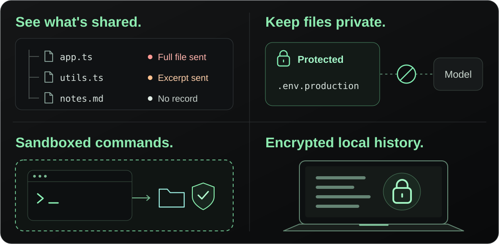
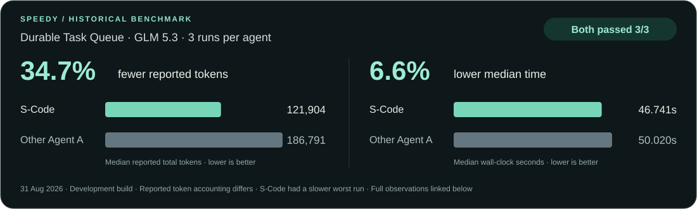

<div align="center">

# S-Code: **safe, speedy, and self-evolving coding agent**

<p>
  <a href="https://code.sai.foundation/"></a>
  &nbsp;
  <a href="#get-started"></a>
  &nbsp;
  <a href="https://sai-foundation.github.io/s-code-docs/"></a>
</p>

<p>
  <a href="LICENSE"></a>
  <a href="docs/deployment/community.md"></a>
  <a href="docs/deployment/preview-release.md"></a>
</p>

</div>

## Safe

**Your code is yours. Sharing it should be your choice.**

See what's sent. Lock what matters. Set the boundaries.
A coding agent should earn your trust—and give you the controls to enforce it.



## Speedy

**Less repeated work. More forward motion.**



Historical development build · GLM 5.3 · one task, three runs each. Reported
tokens are not a billing comparison; results vary by task, and S-Code had the
slower worst run.

## Get started

**Developer Preview** · `v0.1.0-preview.1` · macOS or Linux · Install from source.

**1. Install**

```sh
git clone https://github.com/sai-foundation/s-code.git
cd s-code
scripts/install-from-source.sh
```

The installer offers to install missing build tools and configures your command
path. `./s-code` works immediately in this checkout; new terminals can use `s-code`.

**2. Connect your model**

```sh
./s-code setup
```

Choose your provider, enter your API key and pick a model.

**3. Start coding**

```sh
./s-code       # Terminal
./s-code web   # Browser
```

Prefer a desktop window? [Build the native Mac app →](clients/macos/README.md)

## Choose your model

**SAI · OpenAI · Claude · Gemini · DeepSeek · OpenRouter · Local · Custom**

Use guided setup or **Settings → Connect a provider** in Web. CLI and Web share
local sessions; the Mac app keeps its own connections and history.

## Updates and help

Run `./s-code doctor` to check your setup.

To update, stop S-Code, pull the latest reviewed version and rerun
`scripts/install-from-source.sh`. If the service was running during installation,
run `s-code restart` before using the updated version.

<details>
<summary><strong>Installation options</strong></summary>

- `--check-deps`: check required tools without installing.
- `--yes`: approve dependency installation without the initial prompt.
- `--no-install-deps`: use tools already installed.
- `--no-modify-path`: leave shell configuration unchanged.
- `S_CODE_INSTALL_DIR`: choose where to install; keep it exported when using `./s-code`.

System packages may require administrator access. On macOS, complete Apple's
developer-tools dialog if prompted.

[Installation guide](docs/deployment/community.md)

</details>

## Community

[Homepage](https://code.sai.foundation/) ·
[Documentation](https://sai-foundation.github.io/s-code-docs/) ·
[Contributing](CONTRIBUTING.md) ·
[Issues](https://github.com/sai-foundation/s-code/issues)

## License

[Apache 2.0](LICENSE) · [Project-name policy](TRADEMARKS.md)
