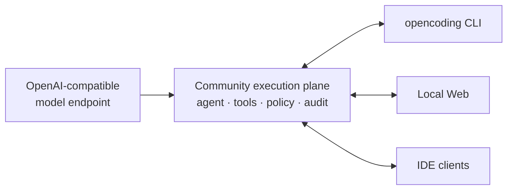

<div align="center">

# Opencoding Community

### Private by default. Faster by design.

**A local-first coding-agent execution plane that finishes real work without giving up control.**

<p>
  <a href="LICENSE"></a>
  <a href="docs/deployment/community.md"></a>
  <a href="docs/architecture/security.md"></a>
  <a href="docs/guides/model-endpoints.md"></a>
</p>


<br />

[**Get started**](#get-started) · [Product docs](https://opencoding-community-docs.shilong86.chatgpt.site) · [Security model](docs/architecture/security.md) · [Performance evidence](docs/testing/README.md#performance-evidence)

</div>

> [!IMPORTANT]
> **Release status:** private source release-candidate development. There is no
> public supported release yet. Staging candidates are identified by an exact
> source commit and workflow run and must not be presented as public releases.

## A coding agent should be fast — and safe enough to run

Opencoding Community brings the CLI, Local Web, sessions, tools, model routing,
policy, approvals, audit, storage, Git and MCP into one local execution plane.
The result is a harness designed for completed, externally verified work rather
than impressive-looking partial output.

| 🔒 Private by default | ⚡ Efficient by design | ✅ Evidence, not promises |
| --- | --- | --- |
| Commands run inside an OS sandbox, network access starts off, and writes stay inside the authorized workspace. | Bounded context, revision-safe edits and a low-overhead local fast path reduce repeated model and tool work. | Tests, diffs, usage, approvals and audit events remain attached to the same replayable session. |

## Measured against OpenCode

On frozen hard coding tasks using the same `z-ai/glm-5.3` backend and the same
external grader, Community completed every selected run while using fewer
tokens and leading on median latency.

| Frozen task | Community | OpenCode | Community advantage |
| --- | ---: | ---: | ---: |
| Durable Task Queue · median of 3 passing runs | **46.741s · 121,904 tokens** | 50.020s · 186,791 tokens | **6.6% faster · 34.7% fewer tokens** |
| Dependency Flow Runner · current completed comparison | **58.820s · 128,873 tokens** | 105.875s · 351,329 tokens | **44.4% faster · 63.3% fewer tokens** |

These are transparent task-specific measurements, not a claim that every model,
repository or individual run will be faster. Community had a 102.896-second
Queue outlier, which is disclosed with the full samples and comparison rules in
[Performance evidence](docs/testing/README.md#performance-evidence).

### Why the harness does less work

```text
read numbered evidence → make revision-safe edits → run real checks → keep only useful context
```

- **Precise file operations:** numbered reads and revision-guarded line edits
  reduce malformed patches, stale writes and recovery turns.
- **Bounded history:** older tool payloads compact while recent evidence stays
  detailed, preventing every model call from replaying the whole session.
- **No hidden model work:** ephemeral runs do not make a second provider request
  just to generate a title.
- **Fast local approvals:** safe workspace-only commands can execute immediately
  while still producing a decided approval record for audit.
- **One execution plane:** CLI and Local Web share the same sessions and events;
  there is no duplicate agent loop or split-brain state to reconcile.

## Privacy is an execution boundary, not a prompt

| Control | Community behavior |
| --- | --- |
| **Command isolation** | macOS Seatbelt and Linux sandbox profiles enforce the selected read-only or workspace-write boundary. |
| **Network isolation** | Tool commands start with network access disabled; enabling it is an explicit, separately governed capability. |
| **Secret protection** | Sensitive paths, parent traversal and credential-shaped tool output are blocked or redacted before publication. |
| **Browser safety** | Local Web uses a one-time bootstrap and an HttpOnly, SameSite=Strict cookie; provider and daemon credentials never enter browser JavaScript or storage. |
| **Private local state** | The local database is permission-restricted, rejects symlink targets and keeps sensitive session content encrypted. |
| **Minimal audit** | Signed audit evidence can prove execution metadata without persisting model prompts, source code or tool output. |

This is a stronger built-in boundary than a permission-dialog-only workflow.
OpenCode's own [security policy](https://github.com/anomalyco/opencode/security)
states that its agent is not sandboxed and recommends Docker or a VM when
isolation is required. Opencoding makes isolation part of the normal local
execution path and backs the controls with executable privacy and security
tests.

## Get started

### 1. Install from source

Prerequisites: macOS or Linux, Rust 1.89, Node.js 22, npm, Python 3, Git,
ripgrep (`rg`) and the platform build toolchain.

```sh
git clone https://github.com/shilongliu-iteria/opencoding-community.git
cd opencoding-community
scripts/install-from-source.sh
```

The default destination is `$HOME/.local/bin`. Set
`OPENCODING_INSTALL_DIR` to choose another location and make sure it is on
`PATH`.

### 2. Choose your interface

```sh
opencoding
# or
opencoding web
```

Both clients see the same sessions, tools, approvals and execution events.
`opencoding` is the public command; packaged CLI and daemon helpers are internal
implementation details.

> [!NOTE]
> Community currently publishes no precompiled archive, binary installer or
> automatic updater. To update, pull a reviewed revision or version tag and run
> `scripts/install-from-source.sh` again.

## One local execution plane



The execution service owns sessions, Agent execution, tools, approvals, audit
and local persistence. The model endpoint owns the provider credential. This
keeps the browser thin, the trust boundary legible and every client consistent.

Read the [architecture overview](docs/architecture/overview.md) for the process
and trust boundaries.

## Bring your model endpoint

Connect an OpenAI-compatible endpoint without replacing the coding harness.
The repository also contains an independent development API Server; it is not
part of the installed application:

```sh
cargo build --locked --release -p opencoding-api-server
OPENROUTER_API_KEY='your-key' \
  target/release/opencoding-api-server
```

Keep credentials in the API Server process environment or an external secret
manager. Never commit them or enter them in Local Web. The default development
endpoint is `http://127.0.0.1:18787/v1`.

## Verify the product yourself

Install `cargo-deny` and `cargo-audit`, then run the complete Community gate:

```sh
scripts/verify-community.sh
```

The gate validates the repository manifest, docs, formatting, Clippy, Rust
tests, dependency policy, advisories, generated protocol bindings, Local Web,
the documentation site and the source-installation contract.

## Explore

| Start here | Purpose |
| --- | --- |
| [**Product documentation**](https://opencoding-community-docs.shilong86.chatgpt.site) | Responsive product guides and architecture reference |
| [Security architecture](docs/architecture/security.md) | Sandbox, credentials, browser and audit boundaries |
| [Tools and permissions](docs/guides/tools-permissions.md) | Understand exactly what the agent may do |
| [Model endpoints](docs/guides/model-endpoints.md) | Connect an OpenAI-compatible provider |
| [Performance evidence](docs/testing/README.md#performance-evidence) | Benchmark method, samples and limitations |
| [Contributing](CONTRIBUTING.md) | Development workflow and DCO requirements |

## Open foundation

Opencoding Community is independent and is not affiliated with, sponsored by,
or endorsed by the OpenCode project or its maintainers.

The source is licensed under the [Apache License, Version 2.0](LICENSE).
Contributions require [Developer Certificate of Origin](DCO) sign-off. Project
names and marks follow [`TRADEMARKS.md`](TRADEMARKS.md).
