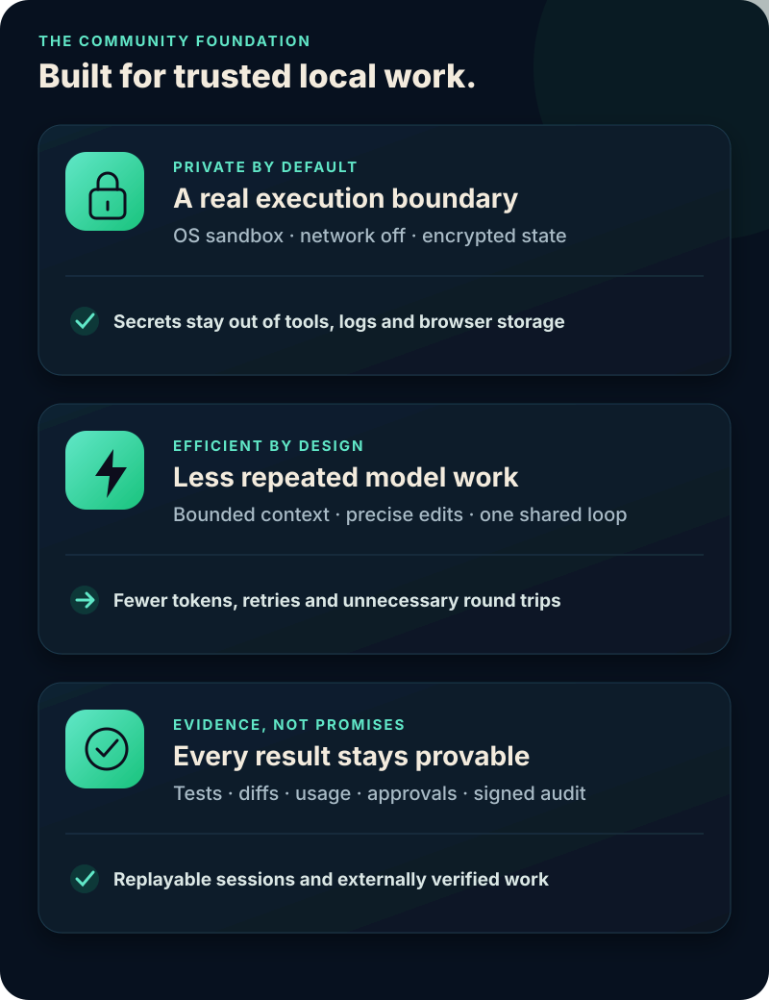
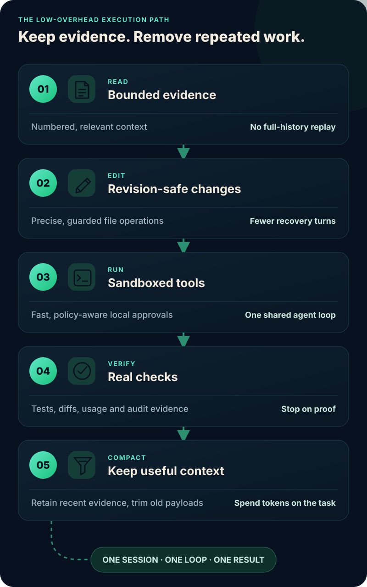
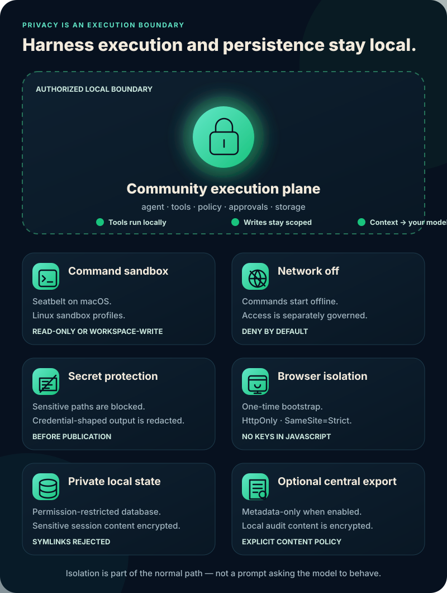
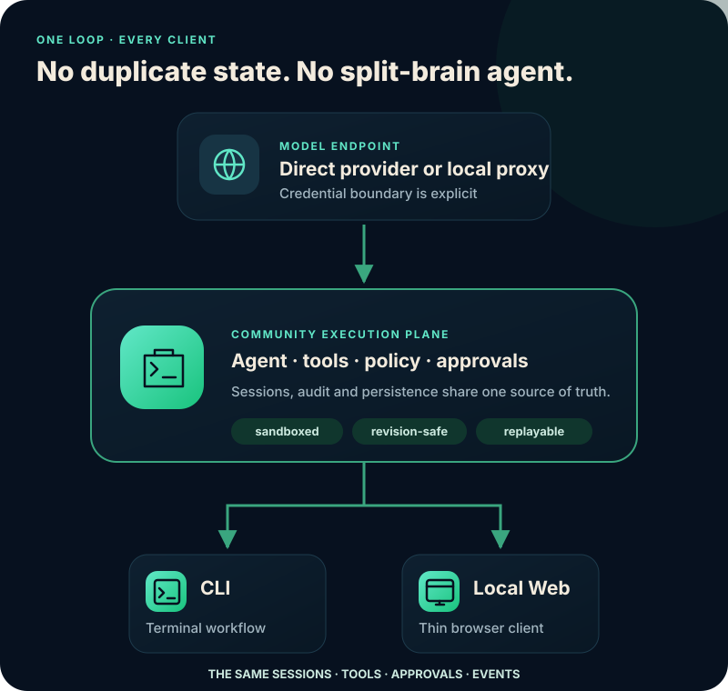

<div align="center">

# S-Code

### Private by default. Efficient by design.

**A local-first coding-agent execution plane that finishes real work without giving up control.**

<p>
  <a href="LICENSE"></a>
  <a href="docs/deployment/community.md"></a>
  <a href="docs/architecture/security.md"></a>
  <a href="docs/guides/model-endpoints.md"></a>
</p>


<br />

[**Get started**](#get-started) · [Product docs](https://s-code-docs.shilong86.chatgpt.site) · [Security model](docs/architecture/security.md) · [Benchmark method](docs/testing/README.md#coding-harness-benchmarks)

</div>

> [!IMPORTANT]
> **Release status:** `v0.1.0-preview.1` candidate development. The repository
> remains private until the final publication gate, so there is no public
> supported release yet. Candidates are identified by an exact Community
> commit and workflow run and must not be presented as public releases.

## A coding agent should be fast — and safe enough to run

S-Code brings the CLI, Local Web, sessions, tools, model routing,
policy, approvals, audit, storage, Git and MCP into one local execution plane.
The result is a harness designed for completed, externally verified work rather
than impressive-looking partial output.

<div align="center">



</div>

## Built to be measured, not benchmark-decorated

Community ships frozen algorithm, repository and frontend tasks with repeatable
trusted-workspace outcome checks. A comparison is publishable only when the exact public source
revision, raw run artifacts, model route, harness configuration and passing
check result can all be reproduced. These local checks are not an adversarial
anti-cheat boundary, and the preview does not publish a universal
speed or token ranking. See the [benchmark method](docs/testing/README.md#coding-harness-benchmarks)
and run the graders against the harnesses and models you care about.

### Why the harness does less work

<div align="center">



</div>

<details>
<summary><strong>How each step saves model work</strong></summary>

- **Precise file operations** reduce malformed patches, stale writes and
  recovery turns.
- **Bounded history** compacts older payloads without discarding recent
  evidence.
- **No hidden model work** means ephemeral runs do not make a second provider
  request just to generate a title.
- **Fast local approvals** avoid unnecessary round trips while retaining an audit
  decision.
- **One execution plane** keeps the CLI and Local Web on the same sessions and
  events.

</details>

## Privacy is an execution boundary, not a prompt

<div align="center">



</div>

This is a stronger built-in boundary than a permission-dialog-only workflow.
OpenCode's own [security policy](https://github.com/anomalyco/opencode/security)
states that its agent is not sandboxed and recommends Docker or a VM when
isolation is required. S-Code makes isolation part of the normal local
execution path and backs the controls with executable privacy and security
tests.

<details>
<summary><strong>Inspect the six enforced controls</strong></summary>

- **Command sandbox:** macOS Seatbelt and Linux sandbox profiles enforce the
  selected read-only or workspace-write boundary.
- **Network off:** tool commands start without network access; enabling it is a
  separately governed capability.
- **Secret protection:** well-known sensitive workspace paths, parent traversal
  and high-confidence credential-shaped process output are blocked or redacted.
- **Browser isolation:** Provider keys and the daemon bearer token never enter
  browser JavaScript, Web Storage, or URLs. Only authenticated local clients
  (the installed launcher or experimental IDE client) may mint a single-use
  browser bootstrap. It hands
  that value through a URL fragment, which the page erases immediately before
  exchanging it for an HttpOnly, SameSite=Strict cookie.
- **Private local state:** fresh installs keep state under
  `~/.s-code/state`, use private filesystem permissions and encrypt
  sensitive transcript, attachment, extension and audit payloads with a locally
  generated managed key. Operational indexes remain plaintext.
- **Protected audit:** local audit payloads and transcript content are encrypted;
  content-free metadata can be exported separately for verification.

</details>

## Get started

### 1. Install from source

Prerequisites: macOS or Linux, Rust 1.89, Node.js 22, npm, Python 3, Git and
the platform build toolchain. Linux command isolation also
requires Bubblewrap (`sudo apt install bubblewrap`, `sudo dnf install
bubblewrap`, or `sudo pacman -S bubblewrap`).

```sh
git clone https://github.com/sl-7qx/s-code.git
cd s-code
scripts/install-from-source.sh
```

The default destination is `$HOME/.local/bin`. Set
`S_CODE_INSTALL_DIR` to choose another location and make sure it is on
`PATH`.

### 2. Connect a model

```sh
s-code setup
s-code doctor
```

`setup` supports OpenRouter, OpenAI, Anthropic, Gemini, local and custom
OpenAI-compatible endpoints. It stores only the environment-variable handle,
never the provider secret. `doctor` verifies the local service, encrypted
storage, credential-handle availability and bounded model-catalog reachability
before the first task. Because some providers expose a public model catalog,
only the first real task can prove that a provider accepted the credential.

### 3. Choose your interface

```sh
s-code
# or
s-code web
```

The CLI starts the loopback service automatically. Both clients see the same
sessions, tools, approvals and execution events.
`s-code` is the public command; packaged CLI and daemon helpers are internal
implementation details.

> [!NOTE]
> Community currently publishes no precompiled archive, binary installer or
> automatic updater. To update, stop S-Code, pull a reviewed revision or
> version tag, run `scripts/install-from-source.sh`, then start `s-code`
> again. The installer never kills active work; if you installed while the old
> service was still active, run `s-code restart`.
>
> **Moving from Opencoding Community:** S-Code starts a fresh installation and
> profile, including when the old candidate used `v0.1.0-preview.1`. Stop the old
> daemon using its original launcher, preserve `~/.opencoding` and the old binary
> if you need its history, then run `s-code setup` to create `~/.s-code`.
> Do not reuse old databases, backups or configuration with S-Code: encryption
> identifiers, database migrations and client namespaces changed. The rename
> leaves your old state untouched; no in-place migration is provided.

## One local execution plane

<div align="center">



</div>

The execution service owns sessions, Agent execution, tools, approvals, audit
and local persistence. In direct-provider mode the daemon resolves the named
environment handle and sends the request, so the daemon process can access that
credential value. With an independent local model proxy, only the proxy holds
the provider key and the daemon needs no provider secret. Both modes keep the
browser thin and outside the provider-credential boundary.

Read the [architecture overview](docs/architecture/overview.md) for the process
and trust boundaries.

## Bring your model endpoint

Connect a provider without replacing the coding harness:

```sh
export OPENROUTER_API_KEY='your-key'
s-code setup --provider openrouter --model z-ai/glm-5.3 --yes
s-code doctor
```

The repository also contains an independent development API Server; it is not
part of the installed application:

```sh
cargo build --locked --release -p s-code-api-server
OPENROUTER_API_KEY='your-key' \
  target/release/s-code-api-server
```

When using the independent API Server, keep credentials in that process
environment or an external secret manager. In direct-provider mode, export the
credential handle to the daemon's environment. Never commit a value or enter it
in Local Web. The default development proxy endpoint is
`http://127.0.0.1:18787/v1`.

## Verify the product yourself

Install `cargo-deny`, `cargo-audit` and `cargo-about` using the pinned commands
in [contributor setup](CONTRIBUTING.md#development), then run the complete
Community gate from a clean checkout (or a fresh source-archive extraction):

```sh
scripts/verify-community.sh
```

The gate validates the repository manifest, docs, formatting, Clippy, Rust
tests, dependency policy, advisories, generated protocol bindings, Local Web,
the documentation site and the source-installation contract.

## Explore

- 📚 [**Product documentation**](https://s-code-docs.shilong86.chatgpt.site) — responsive guides and architecture reference
- 🛡️ [Security architecture](docs/architecture/security.md) — sandbox, credentials, browser and audit boundaries
- 🔧 [Tools and permissions](docs/guides/tools-permissions.md) — exactly what the agent may do
- 🧠 [Model endpoints](docs/guides/model-endpoints.md) — connect an OpenAI-compatible provider
- 📊 [Benchmark method](docs/testing/README.md#coding-harness-benchmarks) — frozen tasks, outcome graders and publication rules
- 🤝 [Contributing](CONTRIBUTING.md) — development workflow and DCO requirements

## Open foundation

S-Code is independent and is not affiliated with, sponsored by,
or endorsed by the OpenCode project or its maintainers.

The source is licensed under the [Apache License, Version 2.0](LICENSE).
Contributions require [Developer Certificate of Origin](DCO) sign-off. Project
names and marks follow [`TRADEMARKS.md`](TRADEMARKS.md).
