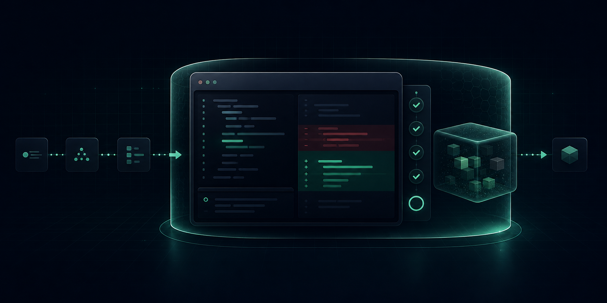
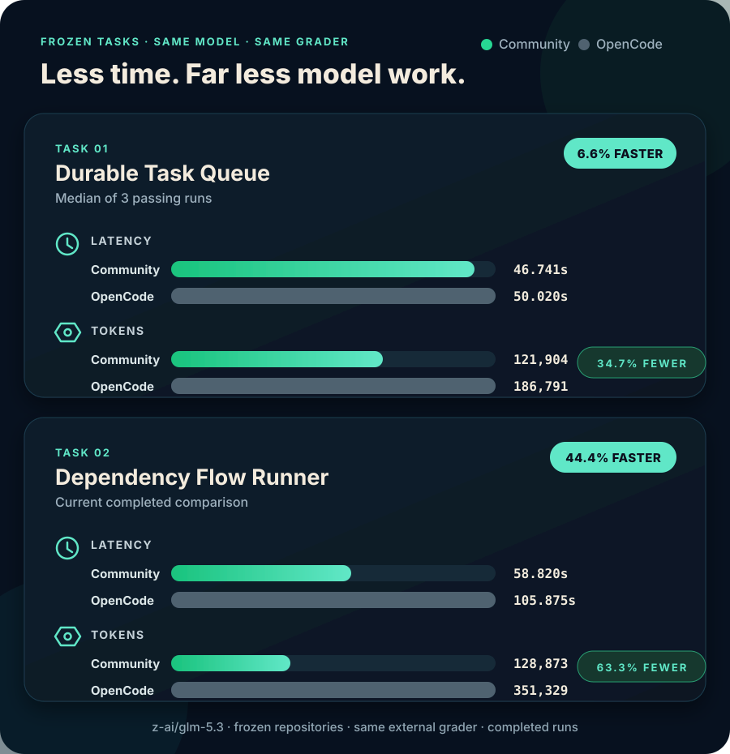

<div align="center">

# Opencoding Community

### Private by default. Faster by design.

**A local-first coding-agent execution plane that finishes real work without giving up control.**

<p>
  <a href="LICENSE"></a>
  <a href="docs/deployment/community.md"></a>
  <a href="docs/architecture/security.md"></a>
  <a href="docs/guides/model-endpoints.md"></a>
</p>



<br />

[**Get started**](#get-started) · [Product docs](https://opencoding-community-docs.shilong86.chatgpt.site) · [Security model](docs/architecture/security.md) · [Performance evidence](docs/testing/README.md#performance-evidence)

</div>

> [!IMPORTANT]
> **Release status:** `v0.1.0-preview.1` candidate development. The repository
> remains private until the final publication gate, so there is no public
> supported release yet. Candidates are identified by an exact Community
> commit and workflow run and must not be presented as public releases.

## A coding agent should be fast — and safe enough to run

Opencoding Community brings the CLI, Local Web, sessions, tools, model routing,
policy, approvals, audit, storage, Git and MCP into one local execution plane.
The result is a harness designed for completed, externally verified work rather
than impressive-looking partial output.

<div align="center">


</div>

## Measured against OpenCode

On frozen hard coding tasks using the same `z-ai/glm-5.3` backend and the same
external grader, Community completed every selected run while using fewer
tokens and leading on median latency.

<div align="center">



</div>

These are transparent task-specific measurements, not a claim that every model,
repository or individual run will be faster. Community had a 102.896-second
Queue outlier, which is disclosed with the full samples and comparison rules in
[Performance evidence](docs/testing/README.md#performance-evidence).

### Why the harness does less work

<div align="center">


</div>

<details>
<summary><strong>How each step saves model work</strong></summary>

- **Precise file operations** reduce malformed patches, stale writes and
  recovery turns.
- **Bounded history** compacts older payloads without discarding recent
  evidence.
- **No hidden model work** means ephemeral runs do not make a second provider
  request just to generate a title.
- **Fast local approvals** avoid unnecessary round trips while retaining an audit
  decision.
- **One execution plane** keeps the CLI and Local Web on the same sessions and
  events.

</details>

## Privacy is an execution boundary, not a prompt

<div align="center">


</div>

This is a stronger built-in boundary than a permission-dialog-only workflow.
OpenCode's own [security policy](https://github.com/anomalyco/opencode/security)
states that its agent is not sandboxed and recommends Docker or a VM when
isolation is required. Opencoding makes isolation part of the normal local
execution path and backs the controls with executable privacy and security
tests.

<details>
<summary><strong>Inspect the six enforced controls</strong></summary>

- **Command sandbox:** macOS Seatbelt and Linux sandbox profiles enforce the
  selected read-only or workspace-write boundary.
- **Network off:** tool commands start without network access; enabling it is a
  separately governed capability.
- **Secret protection:** sensitive paths, parent traversal and
  credential-shaped output are blocked or redacted.
- **Browser isolation:** Local Web uses a one-time bootstrap and an HttpOnly,
  SameSite=Strict cookie. Credentials never enter browser JavaScript or
  storage.
- **Private local state:** fresh installs keep state under
  `~/.opencoding/state`, use private filesystem permissions and encrypt
  sensitive session content with a locally generated managed key.
- **Minimal audit:** signed metadata proves execution without retaining prompts,
  source code or tool output.

</details>

## Get started

### 1. Install from source

Prerequisites: macOS or Linux, Rust 1.89, Node.js 22, npm, Python 3, Git,
ripgrep (`rg`) and the platform build toolchain.

```sh
git clone https://github.com/shilongliu-iteria/opencoding-community.git
cd opencoding-community
scripts/install-from-source.sh
```

The default destination is `$HOME/.local/bin`. Set
`OPENCODING_INSTALL_DIR` to choose another location and make sure it is on
`PATH`.

### 2. Connect a model

```sh
opencoding setup
opencoding doctor
```

`setup` supports OpenRouter, OpenAI, Anthropic, Gemini, local and custom
OpenAI-compatible endpoints. It stores only the environment-variable handle,
never the provider secret. `doctor` verifies the local service, encrypted
storage and credential availability before the first task.

### 3. Choose your interface

```sh
opencoding
# or
opencoding web
```

The CLI starts the loopback service automatically. Both clients see the same
sessions, tools, approvals and execution events.
`opencoding` is the public command; packaged CLI and daemon helpers are internal
implementation details.

> [!NOTE]
> Community currently publishes no precompiled archive, binary installer or
> automatic updater. To update, pull a reviewed revision or version tag and run
> `scripts/install-from-source.sh` again.

## One local execution plane

<div align="center">


</div>

The execution service owns sessions, Agent execution, tools, approvals, audit
and local persistence. The model endpoint owns the provider credential. This
keeps the browser thin, the trust boundary legible and every client consistent.

Read the [architecture overview](docs/architecture/overview.md) for the process
and trust boundaries.

## Bring your model endpoint

Connect a provider without replacing the coding harness:

```sh
export OPENROUTER_API_KEY='your-key'
opencoding setup --provider openrouter --model z-ai/glm-5.3 --yes
opencoding doctor
```

The repository also contains an independent development API Server; it is not
part of the installed application:

```sh
cargo build --locked --release -p opencoding-api-server
OPENROUTER_API_KEY='your-key' \
  target/release/opencoding-api-server
```

Keep credentials in the API Server process environment or an external secret
manager. Never commit them or enter them in Local Web. The default development
endpoint is `http://127.0.0.1:18787/v1`.

## Verify the product yourself

Install `cargo-deny` and `cargo-audit`, then run the complete Community gate:

```sh
scripts/verify-community.sh
```

The gate validates the repository manifest, docs, formatting, Clippy, Rust
tests, dependency policy, advisories, generated protocol bindings, Local Web,
the documentation site and the source-installation contract.

## Explore

- 📚 [**Product documentation**](https://opencoding-community-docs.shilong86.chatgpt.site) — responsive guides and architecture reference
- 🛡️ [Security architecture](docs/architecture/security.md) — sandbox, credentials, browser and audit boundaries
- 🔧 [Tools and permissions](docs/guides/tools-permissions.md) — exactly what the agent may do
- 🧠 [Model endpoints](docs/guides/model-endpoints.md) — connect an OpenAI-compatible provider
- 📊 [Performance evidence](docs/testing/README.md#performance-evidence) — benchmark method, samples and limitations
- 🤝 [Contributing](CONTRIBUTING.md) — development workflow and DCO requirements

## Open foundation

Opencoding Community is independent and is not affiliated with, sponsored by,
or endorsed by the OpenCode project or its maintainers.

The source is licensed under the [Apache License, Version 2.0](LICENSE).
Contributions require [Developer Certificate of Origin](DCO) sign-off. Project
names and marks follow [`TRADEMARKS.md`](TRADEMARKS.md).
